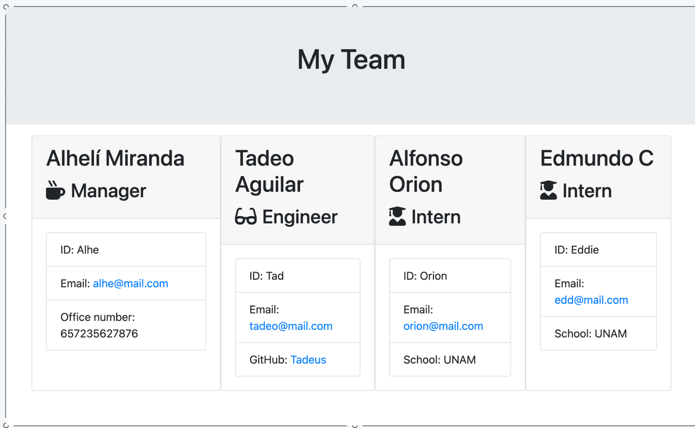

# **Team_Profile_Generator**
A simple Team Profile Generator to make the life of you company much more easier on the day to day!!


## Description 
This is a simple app that will make your life easier, just by helping you create an HTML file, that will help you create a work team


## Table of contents
- [Description](#Description)
- [Installation](#Installation)
- [How it looks](#Visuals)
- [Usage](#Usage)
- [Repository Link](#Repository)
- [GitHub Info](#GitHub) 


## Visuals 

```
As a manager
I want to generate a webpage that displays my team's basic info
so that I have quick access to emails and GitHub profiles
```

  
  
## Installation
_To install necessary dependencies, you should run the following command:_
  > npm install then you should run the application in node, using the dependencies wich are, [jest](https://jestjs.io/) for running the provided tests, and [inquirer](https://www.npmjs.com/package/inquirer) for collecting input from the user.
  The application will be invoked by using the following command:

```bash
node app.js
```
 And then respond all the questions that prompts to you, in order to generate the new file.

 ## Instructions

 ```md
GIVEN a command-line application that accepts user input
WHEN I am prompted for information about my team´s members
THEN a professional .html file is generated with the title of team.html
```
  

## Usage
```
As a manager
I want to generate a webpage that displays my team's basic info
so that I have quick access to emails and GitHub profiles
```

---


## Repository
- [Project Repo](https://github.com/AlheliMi/Team_Profile_Generator.git)
- [Project Link](https://alhelimi.github.io/Team_Profile_Generator/)

## Questios, Coments, Sugestions
If you have any questios about the repo, you can open an issue or contact directly to me at alhealhe72@hotmail.com. Or at gitHub AlheliMi.